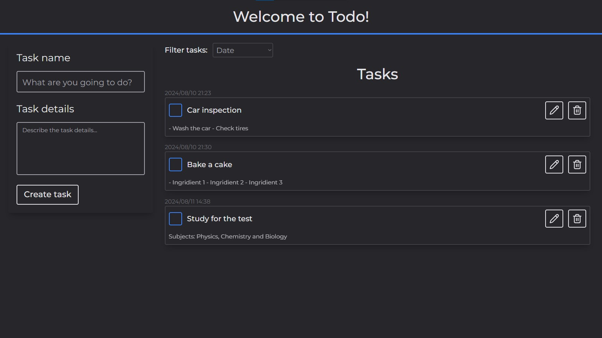

# Todo

A simple responsive to-do list made with ReactJS to help you organize yourself and avoid procrastination.

## Table of Contents
1. [Screenshots](#screenshots)
2. [Functionalities](#functionalities)
4. [Running Locally](#running-locally)
5. [Learnings](#learnings)
6. [About Me](#about-me)

## Screenshots




## Functionalities

- Add tasks and details to them
- Edit and delete your tasks as needed
- Filter your tasks to see which ones are already completed
- Responsive design

## Running Locally

Clone the project

```bash
  git clone https://link-to-the-project
```

Navigate to the project directory

```bash
  cd my-project
```

Install the dependencies

```bash
  npm install
```

Start the server

```bash
  npm run dev
```

Repeat these steps for both frontend and backend files.

## Learnings

It was a simple website, but it took much longer than expected. It seemed simple, but there were a lot of things I had never done before in code.

## About me 🙂
I'm 17 years old, studying programming for fun. I aspire to be a full-stack developer.
